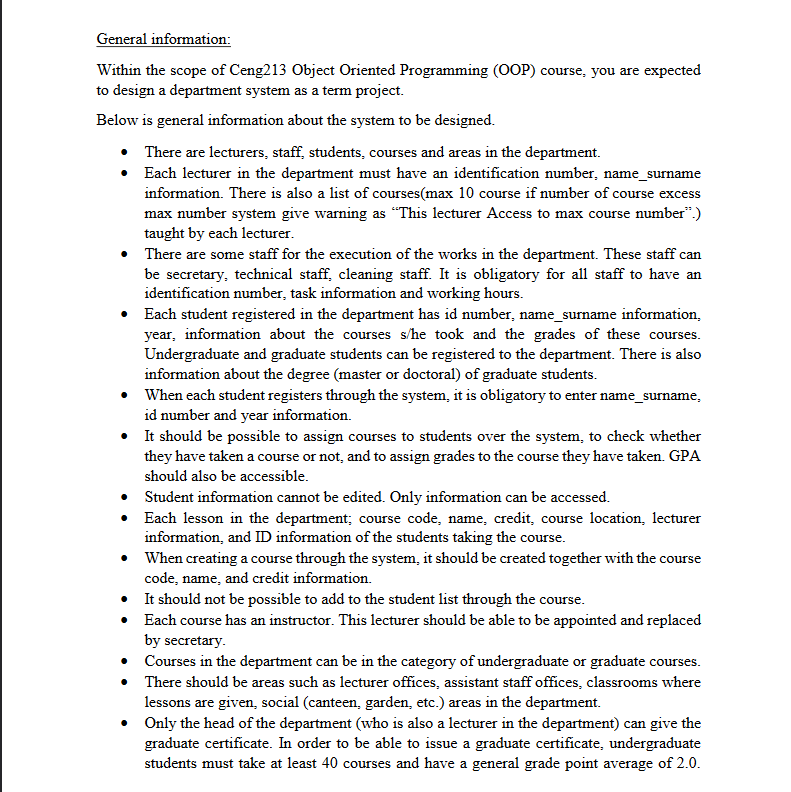
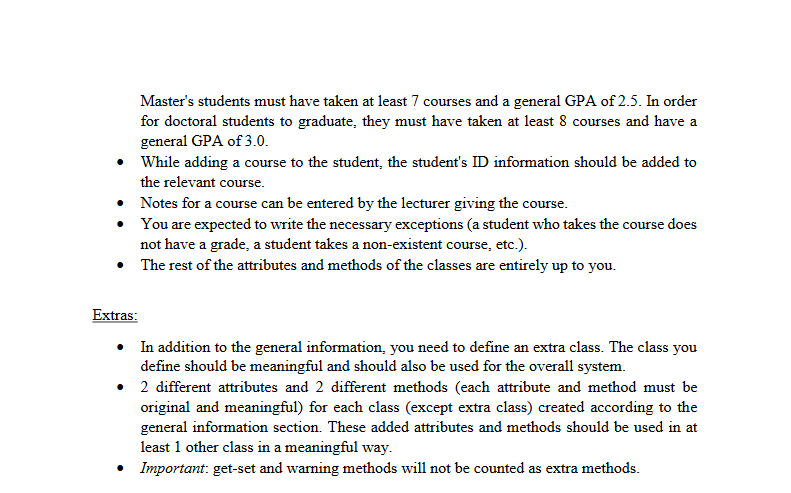

## Abdullah Salih Öner -
### "OOP term-project"

#PROJECT INFORMATION

## Student Class Methods

### getGradesCourse()
    This method prints all grades of courses taken by the student

### addCourse(Course course)
    This method adds new course to the student
    This method is used by Student Affairs

### givePoint(Course course, int point)
    This method gives point for the course selected
    This method is used by Lecturer of the course

### takenCourseNumber()
    This method prints taken course count of the student

### calculateGPA()
    This method calculates GPA with student's grades and credits

## Secretary Class Methods

### addLecturerToTheCourse(Lecturer lecturer,Course course)
    This method adds lecturer to the cours

### addClassToTheCourse(Course course,Area area)
    This method adds course to the course

### changeLecturerOfTheCourses(Lecturer lecturer,Course course)
    This method changes the lecturer of the course

## Student Affairs Class Methods

### addCourseToStudent(Students student ,Course course)
    This method adds course to the student

### isStudentCanTakeCourse(Students student, Course course)
    This method checks if the student can take the course

## Area Class Methods

### isAvaliable()
    This method checks the area is available

### addAreaToCourse(Course course)
    This method adds area to course
    This method is used by the secretary class

## Course Class Methods

### getStudentsId()
    This method prints studentIDs of the taken course

### addStudent(String ID)
    This method adds StudentID's to course
    This method is used by Student Affairs

## Lecturer Class Methods

### addCourse(Course course)
    This method adds course to givenCourses array
    This method is used by Secretary class

### deleteCourse(Course course)
    This method deletes courses from givenCourses array
    This method is used by Secretary class

### getCourses()
    This method prints all given courses' names and count of the courses

### giveGraduateCertificate(Students student)
    This method gives graduate certificate to the student
    Only Head Of Department can use this method

### addGrade(Course course ,Students student,int point)
    This method adds grade to the student with given course
    Also this method calls the addPoint method from Student class